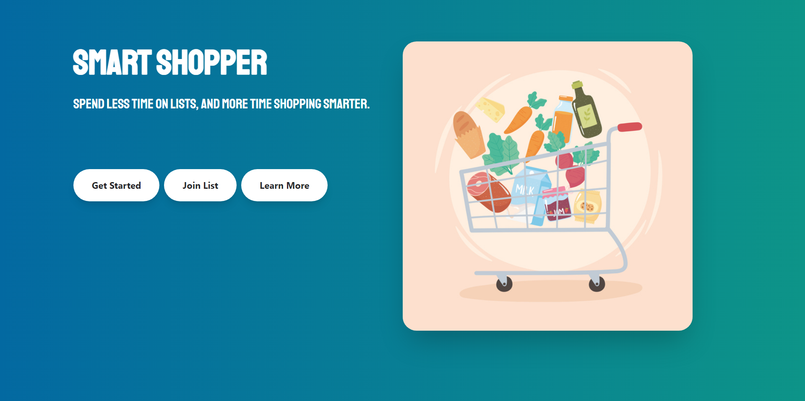
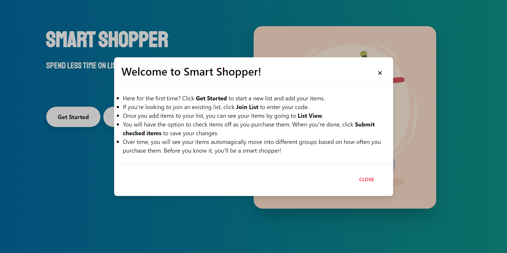
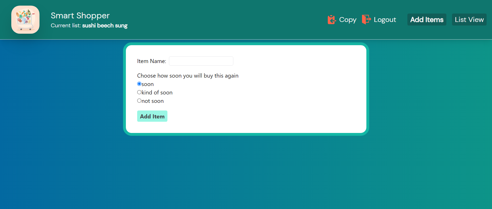

# 
Smart Shopper 

## The app that learns how you shop!

 

## Table of Contents

- [Summary](#Summary)
- [User Guide](#User-Guide)
- [Technologies](#Technologies)
- [Installation](#Installation)
- [Development Team](#Development-Team)
   

## Summary

#### A “smart” shopping list app that learns your buying habits and helps you remember what you’re likely to need to buy on your next trip to the store.

 

#### This application was built with React, Firebase, and Tailwind CSS. Development of this application involved turning user stories into features, weekly pair programming sessions, QA testing, and code reviews.

 

| [GitHub](https://github.com/the-collab-lab/tcl-36-smart-shopping-list) | [Deployed](https://tcl-36-smart-shopping-list.web.app/) |

 

## User Guide

  

  

### As a user, you will enter items (e.g., “Greek yogurt” or “Paper towels”) into your list. Each time you buy the item, you mark it as purchased in the list. Over time, the app comes to understand the intervals at which you buy different items. If an item is likely to be due to be bought soon, it rises to the top of the shopping list.

  

## Technologies

- React
- Tailwind CSS
- Firebase
- JavaScript
- HTML
- CSS
    

## Installation

1. Navigate to the tcl-36-smart-shopping-list folder and install dependencies using `npm install`
2. Add your firebase configurations to `./src/lib/firebase.js`
3. Start locally using `npm run start`
     

## Development Team

### Developers

- [Shelley McHardy](https://github.com/shelleymcq) 🔥
- [DJ Taylor](https://github.com/djtaylor8) ✨
- [Lindsey Dinkel](https://github.com/lindseyindev) 😼
- [Alena M](https://github.com/alenamedved) 🐻

### Mentors

- [Lauren Yu](https://github.com/laurenyz) 🐘
- [Rudi P](https://github.com/rudidev08) 🦁
- [Eddie H](https://github.com/EdwardHinkle) 🦉
